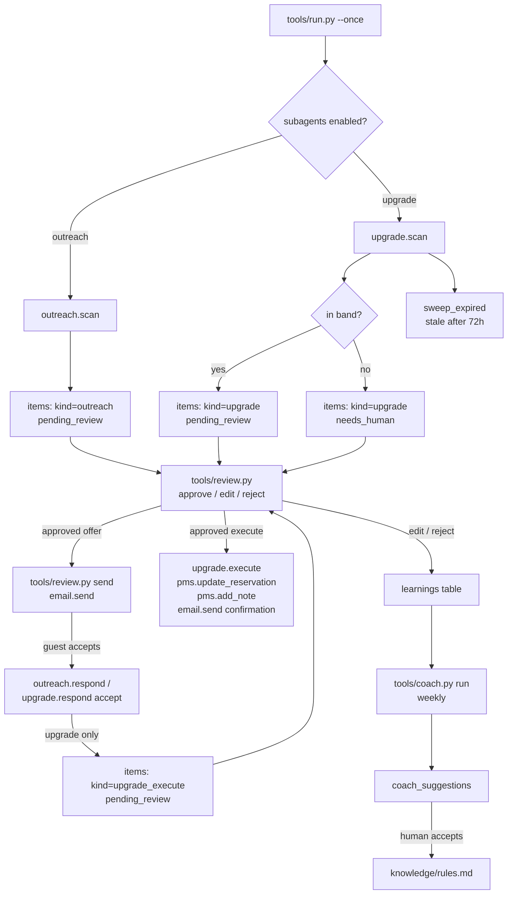

# Upsell AI — "The Merchant"

Runs the whole upsell journey around every booking.

## What it does

**Does.** Runs the whole upsell journey around every booking. Before arrival it reaches out with a warm, personal welcome, then offers the extras that fit that guest: spa, dinner, private chef, transfers, late checkout, a room upgrade. It sends secure payment links by email or text so the guest can book an extra in one tap, and it can come with a branded guest portal page where your guests browse and pre-book your offers themselves. Every sale is charged, logged in the PMS, and confirmed automatically.

## What it won't do

Never spams: it paces every touch and stops when a guest says no. Only sells offers you've approved, at prices inside the bands you set. Anything unusual gets flagged to a human first.

## Why it matters

A guest who has already booked is your easiest sale, and most hotels never ask. This agent asks every guest, at the right moment, with the right offer, and takes payment on the spot.

## What to expect

Pre-arrival upsells add €20–€60 ancillary spend per booking; paid room upgrades alone add ~1.55% total revenue ≈ ~10% profit.

**ROI:** +10% — Profit from upsells & upgrades (revenue).

> Two things this template is honest about up front: **it does not take a
> payment** (no card is charged; the confirmation email's claim is aspirational
> until you wire a payment adapter — see `docs/integrations.md`), and **there
> is no guest portal** (a guest replies to a normal email). Both are real gaps
> in the source this was built from, not gaps introduced here — see
> `docs/how-it-works.md`, "Design decisions" #7.

## Who it's for

Independent hotels and small groups with at least a handful of room tiers and
a mailbox someone actually reads — the two things Track B (room upgrades) and
Track A (pre-arrival outreach) need to be worth running. It replaces the
"someone remembers to email guests before they arrive" job nobody has time
for, and it replaces the manual spreadsheet a revenue manager might keep for
tracking who's been offered an upgrade. It does not replace a person for the
decisions that matter — every send and every PMS write waits for a human
until you decide otherwise (`workflows/90-go-live.md`).

Works for a restaurant too: `does`/`cant`/`why` above become "the wine
pairing, the birthday cake, a bottle on ice, the good table on the terrace"
sold a few days before the booking — see each track's spec for the exact
field mapping if you're adapting this for a restaurant, and ask your Claude
session to walk through it with you.

## How it works

Two tracks share one arrivals book, both deliberately **LLM-free** — every
guardrail is a rule, not a model guess:



**Modes.** `mode: shadow` (default, in `config/hotel.yaml`) — the agent
reads, decides, drafts, and queues. Nothing is ever sent and nothing is ever
written to your PMS - shadow blocks every send, even one you have already
approved. `mode: live` lets an approved item actually go out; nothing
unapproved ever does, live or not. Full detail in `docs/safety.md`.

**The review loop.** Every draft — an outreach email, an upgrade offer, the
PMS write that executes an accepted upgrade — waits in the same queue
(`python3 tools/review.py list`). A human approves, edits, or rejects; only
then can anything leave the building. `workflows/80-review.md`.

**What runs when:**

| Track | Cadence | Command |
|---|---|---|
| Pre-Arrival Outreach (scan) | mornings | `python3 tools/outreach.py scan` (or `make run`) |
| Room Upgrade (scan) | mornings | `python3 tools/upgrade.py scan` (or `make run`) |
| Room Upgrade (expiry sweep) | with every scan | `python3 tools/upgrade.py sweep-expired` |
| Coach | weekly | `python3 tools/coach.py run` |

**Sub-agents.** Both **Room Upgrade AI** and **Pre-Arrival Outreach AI** ship
in this repo and are **on by default** — see "Sub-agents in this repo" below
and `docs/sub-agents.md` for why turning both off leaves nothing running.

Full mechanics, every rule and every guardrail, with the exact formulas: see
`docs/how-it-works.md`.

## What you need

To run the demo below: nothing but Python 3.11+. To run it for real:

- **A way to read your arrivals book** — an export you can turn into CSV
  (`systems.pms.adapter: csv`, works with any PMS, no API access needed), or
  API credentials for a `built` adapter (`cloudbeds` today).
- **A mailbox someone reads** — any IMAP/SMTP mailbox, or Gmail.
- **Your own room type names and your own offer catalogue** — five minutes in
  `config/agent.yaml`, see `workflows/00-setup.md` step 4.
- **A way to think** — `llm.provider: interactive` needs only the Claude Code
  session you already have open; `claude-code` and `anthropic` are covered in
  `docs/safety.md`. This matters less here than in most of the family: the
  only two LLM calls in the whole repo are a cosmetic run summary and the
  weekly coach suggestion.

Time to get running for real: about 30 minutes once you have a CSV export or
API credentials in hand.

## Quick start (5 minutes, no credentials)

```bash
git clone https://github.com/th1-ai/upsell-ai.git upsell-ai && cd upsell-ai
make setup
make demo
```

Expect to see something like:

```
Upsell AI demo - arrivals book as of 2026-09-01 from fixtures/hotel/reservations.json

Track B - Room Upgrade: 6 offer(s) drafted and ready for approval, 1 held for a human OK (outside the surcharge band), 6 skipped.
    skipped HA-1101: already in the Meridian Suite - top of the ladder
    skipped HA-1107: group block - a person owns this conversation
    skipped HA-1108: no Deluxe Sea View free across the stay - nothing to sell tonight
    skipped HA-1109: outside the 14-day window - enters it in 6 day(s)
    skipped HA-1111: already in the Meridian Suite - top of the ladder
    skipped HA-1113: already in house - in-stay upsells belong to a person

(For this demo only, HA-1105's upgrade offer is pre-seeded as already sent - written straight to the database, never through email.send() - so Track A below has a real conversation to skip. See docs/how-it-works.md.)

Track A - Pre-Arrival Outreach: 10 drafted, 2 skipped, 12 in the 21-day window.
    skipped HA-1111: Already emailed - never double-mail a guest
    skipped HA-1105: Active upgrade conversation open - no cross-selling mid-thread

A steady morning: outreach and upgrade offers went out inside every guardrail, and nothing needed a name or number invented.

Everything else stayed in shadow mode: neither scan ever calls send() on its own, and every other draft above is still just sitting in the queue.
Next: `make review` to see the drafts, or read workflows/10-upsell-journey.md.

DEMO OK - 10 outreach drafted, 6 upgrade offer(s) drafted, 1 held (shadow)
```

Then `make doctor` — expect one `FAIL` (`hotel identity`, because the
property is still the shipped placeholder "Hotel Aurora") and a couple of
`warn` lines. That is the intended state of a fresh clone; see
`workflows/00-setup.md` for filling in the real property, room ladder, and
offer catalogue.

## Set up with Claude Code

Open `claude` in this folder. Paste each prompt below when you reach it —
each phase names the workflow file Claude will follow.

**Phase 1 — first run.**

> Read `workflows/00-setup.md` and walk me through it: run `make setup` and
> `make demo`, show me the output, then help me fill in `config/hotel.yaml`
> and `config/agent.yaml` (my room types, low to high, and what I actually
> sell as extras). Ask me for the details you need rather than guessing.

**Phase 2 — connect a real arrivals book.**

> Read `docs/integrations.md`. I want to connect
> `systems.pms.adapter: csv` — help me export my reservations into the
> columns it expects and drop them in `data/imports/`, then run
> `make doctor` and tell me what it says.

**Phase 3 — run it for real.**

> Read `workflows/10-upsell-journey.md`. Run `python3 tools/run.py --once`
> and show me what got drafted for each track. If `llm.provider` is
> `interactive` and it asks you something, tell me what it's asking before
> you answer it.

**Phase 4 — work the queue.**

> Read `workflows/80-review.md`. Show me what's waiting
> (`python3 tools/review.py list`), read me the first outreach draft and the
> first upgrade draft in plain language, and wait for my decision on each
> before you approve, edit, or reject anything.

**Phase 5 — a guest replies.**

> Read `workflows/21-pre-arrival-outreach.md` and
> `workflows/22-room-upgrades.md`. A guest replied to <this email> — help me
> work out what they want and run the right `respond` command.

**Phase 6 — the weekly coach pass.**

> Read `workflows/85-coach-weekly.md`. Run `python3 tools/coach.py run`, show
> me the suggestions in plain language, and only accept or dismiss the ones I
> tell you to.

**Phase 7 — go live.**

> Read `workflows/90-go-live.md`. Walk me through the checklist honestly —
> don't tell me I'm ready if I'm not — and if I am, apply the switch and
> tell me exactly what's different now.

## Connect your systems

Everything ships on the `mock` adapter (no credentials, `fixtures/hotel/` and
`fixtures/inbound/` only). Check what's actually working at any time:

```bash
make doctor
```

| System | Adapter | Status | Needs |
|---|---|---|---|
| PMS | `mock` | universal | nothing — `fixtures/hotel/*.json` |
| PMS | `csv` | universal | a reservations export in `data/imports/` — **start here** |
| PMS | `cloudbeds` | built | OAuth app + refresh token |
| PMS | `cli` | universal | a JSON-speaking vendor CLI |
| Email | `mock` | universal | nothing — appends to `data/exports/sent_email.jsonl` |
| Email | `imap` | universal | a mailbox + an app password — **start here** |
| Email | `gmail` | built | Google OAuth desktop client |

Messaging, Sheets, and every stub family (POS, Accounting, Reviews,
Calendar, Payments, Procurement, Locks, Courier) are wired into `core/` for
the whole agent family but **this agent never calls them** — see
`docs/integrations.md` for the full detail, including how to carry your own
guest CRM fields (VIP tier, occasion, profile notes, past upsells) into
`Reservation.extra` so the profile matcher has real data to work with.

## Run it

```bash
make run                            # one pass, both tracks
make run ARGS="--only outreach"     # just Track A
make run ARGS="--only upgrade"      # just Track B
make run ARGS="--dry-run"           # compute everything, write nothing
make watch                          # loop on the configured interval
make schedule                       # print a snippet for the first schedule: job
make schedule ARGS="--all"          # one snippet per job in config/agent.yaml's schedule:
```

`workflows/10-upsell-journey.md` covers the loop in full;
`workflows/21-pre-arrival-outreach.md` and `workflows/22-room-upgrades.md`
cover each track's own commands (`scan`, `respond`, and — for upgrades —
`execute` and `sweep-expired`). `workflows/80-review.md` covers the queue.

**Subscription or API.** `llm.provider: interactive` or `claude-code` uses
the Claude Code subscription you already pay for; `anthropic` uses your own
API key for volume. This matters less here than elsewhere in the family —
see "What you need" above — but the honest note still applies: automated use
of a personal subscription is subject to Anthropic's usage policy and rate
limits. A weekly coach run and an occasional cosmetic summary line is a
trivial load either way.

## Go live

`mode: shadow` (the default) means nothing is ever sent and nothing is ever
written to your PMS - shadow is a global kill switch that blocks every send,
even one you have already approved. Going live means an **approved**
outreach email, upgrade offer, or upgrade execution actually happens the
next time someone runs the relevant command — never anything unapproved,
live mode or not. The checklist, and exactly how to flip it (and flip it
back), is `workflows/90-go-live.md`.

## Guardrails & safety

- **Never invents a preference.** A guest with an empty profile gets the two
  generic offers, traced "nothing invented" — never a guessed occasion.
- **Never sells above budget.** No paid offer above 40% of the guest's own
  nightly rate (config: `price_guard_share`); a repeat purchase is exempt.
- **The surcharge band is enforced both ways** (config: `surcharge_band`,
  default €10–€100) — under *and* over is held for a human.
- **Only moves a guest up the ladder, one tier, when the room is genuinely
  free for every night of the stay.**
- **One ask per stay, and a no is final.** No counter-offer path exists.
- **No cross-selling mid-thread** — an unanswered upgrade offer holds off
  outreach to the same guest.
- **Group bookings and in-house guests are out of scope by design.**
- **Executing an upgrade is a second, separate human approval**, apart from
  approving the offer email itself.
- **Card numbers and IBANs are redacted on ingestion**, always on
  (`core/redact.py`).
- **Nothing is ever auto-applied by the coach** — suggestions are a
  checklist for a human, never a live prompt edit.
- **AI disclosure.** Every guest-facing email should carry the EU AI Act
  Article 50 line — see `docs/safety.md` for suggested wording and where it
  lives (`knowledge/signature.md`).

Full detail, the GDPR summary, and the subscription-vs-API note in full:
`docs/safety.md`.

## Sub-agents in this repo

Upsell AI has no engine of its own — on the demo platform and in this repo,
its whole promise is the sum of the two tracks below, which is why **both
ship on by default**. See `docs/sub-agents.md` for exactly how to turn either
off, and `docs/how-it-works.md` for the full mechanics.

### Room Upgrade AI — "The Closer"

**Does.** Scans the book for guests in lower-tier rooms and offers them a paid upgrade to a higher tier, freeing the cheaper rooms, which sell better last-minute. When a guest accepts, it adds the charge, changes the room type, adjusts the rate, and sends the confirmation. The whole transaction, hands-free.

**Won't.** Stays inside its guardrails: only moves guests up the tier ladder, only surcharges in the sane band (€10–€100/night), only books a room that's genuinely available. Anything outside that gets flagged.

**Why.** Cheaper rooms book last-second far more reliably than suites, so shifting guests up the ladder increases total occupancy on top of the upgrade fee.

**Output.** ~1.55% uplift in total revenue ≈ ~10% increase in profit.

Runs as `tools/upgrade.py`. Workflow: `workflows/22-room-upgrades.md`.

### Pre-Arrival Outreach AI — "The Welcomer"

**Does.** Spots upcoming bookings 7–21 days out and sends each guest a personalised welcome that sets the tone, opens the door to upsells (transfers, chef, upgrades), and captures arrival details early. Tracks who's been contacted so nobody is double-mailed.

**Won't.** Keeps the touch personal and paced; won't over-message. Leans premium-first on which bookings to prioritize.

**Why.** Pre-arrival is the highest-leverage upsell and delight window in the journey, and the one most hotels skip.

**Output.** Pre-arrival upsell adds €20–€60 ancillary spend per booking and lifts review scores.

Runs as `tools/outreach.py`. Workflow: `workflows/21-pre-arrival-outreach.md`.

### Coach — Email Optimizer / Coach AI

**Does.** The coach class. Each week it reads every guest reply a human edited, rejected, or thumbed-down, clusters the corrections into patterns, applies the safe knowledge-base fixes itself, and proposes the rest. A sibling captures every human edit as a training pair, so the whole roster keeps getting sharper. A live quality board tracks the numbers that matter — replies sent unchanged, edit severity, hand-off rate — so you watch each agent earn its autonomy week by week.

**Won't.** Doesn't talk to guests. Holds the higher-judgement changes for a human nod; applies the clear-cut ones itself.

**Output.** Drives the human-edit rate down week over week; agents graduate to full autonomy as their edit rate falls below 10%.

This template's version clusters real edits by what they were for and writes
one suggestion per cluster — but, honestly, nothing is auto-applied here
either; see `docs/how-it-works.md` for exactly where this repo's coach is
more built than the source it came from, and where it deliberately isn't.
Runs as `tools/coach.py`. Workflow: `workflows/85-coach-weekly.md`.

## Customizing

- **The offer catalogue.** `config/agent.yaml`'s `offers:` — title, price,
  `price_unit`, `match_keys`. Add, remove, or reprice at any time; the next
  scan picks it up.
- **The room ladder.** `config/agent.yaml`'s `room_ladder` — must match your
  PMS's room type names exactly, low to high.
- **Thresholds.** `price_guard_share`, `surcharge_band`, `upgrade_factor`,
  `window_days`, `outreach_window_days`, `checkin_link_days` — all in
  `config/agent.yaml`, all plain numbers.
- **The email templates.** Both tracks are deliberately LLM-free — the
  subject/opener/body logic lives in `tools/outreach.py` and
  `tools/upgrade.py` as plain Python functions. Ask your Claude session to
  change the wording; the guardrails around *what* gets sent don't move.
- **A language other than English.** `core/i18n.py` ships with the family
  for exactly this; neither track uses it yet in v1 — ask your Claude
  session to wire language detection into `body_for()` if you serve guests
  in more than one language.
- **The coach's prompt.** `prompts/coach-suggest.md` is plain markdown —
  edit it directly, no code involved.

## Troubleshooting & FAQ

**Q: Why didn't guest X get an outreach email or an upgrade offer?**
Run the scan directly — both print every skip with its reason:
`python3 tools/outreach.py scan` / `python3 tools/upgrade.py scan`.

**Q: A reservation is eligible for both tracks — is that a bug?**
No. Each track keeps its own item per reservation; getting both an outreach
email and an upgrade offer is normal, unless the upgrade offer has already
been sent and is awaiting a reply, in which case outreach waits.

**Q: Can it send automatically?**
Yes, once you trust it — `workflows/90-go-live.md`. `mode: shadow` is the
default and the right place to start.

**Q: Does it actually charge the guest's card?**
No — see "What to expect" above and `docs/how-it-works.md`, "Design
decisions" #7. The confirmation email's wording is aspirational until you
wire a real payment adapter.

Full list: `workflows/99-troubleshooting.md`.

## Measuring the benefit

```bash
make report
```

Shows items waiting per track, accepted ancillary and upgrade revenue,
coach suggestions waiting, and LLM spend (which should stay near zero — both
tracks are LLM-free by design). Full detail, what each number means, and the
honest caveats on the roster's own figures: `docs/benefits.md`.

## About

Built by [TH1](https://th1.ai) as one of a family of open-source hotel
AI-agent templates. License: MIT (`LICENSE`). Want this run for you instead
of running it yourself? [th1.ai](https://th1.ai).
