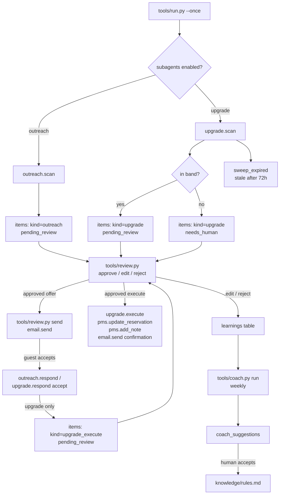

# How Upsell AI works

Upsell AI ("The Merchant") is an umbrella: on the demo platform it has no engine
of its own, it is the sum of two tracks that run against the same arrivals
book. This repo mirrors that shape exactly:

- **Pre-Arrival Outreach** ("The Welcomer") — `tools/outreach.py`
- **Room Upgrade** ("The Closer") — `tools/upgrade.py`
- **Coach** (Email Optimizer / Coach AI applies to this agent) — `tools/coach.py`

Both tracks are **on by default**. The parent's whole promise ("the whole
upsell journey around every booking") only exists as these two tracks — there
is nothing left if you switch both off. Turn either off in `config/agent.yaml`
under `subagents.<name>.enabled` if you only want one half.

## Deterministic decisioning, LLM for language

Both tracks are **deliberately LLM-free** for the same reason the source demo
is: every guardrail (price band, ladder, window, dedup) has to be provable as
a rule, not a model guess, so a hotel can trust it and a human can audit it in
one log line. The only two LLM calls in this whole repo are:

1. `prompts/run-narrative.md` — a cosmetic one-line summary at the end of a
   scan, for the person reading `make run`'s output. Never required, never
   invents a number (the schema only allows a short string or `null`, and a
   deterministic fallback line is always printed underneath it).
2. `prompts/coach-suggest.md` — the weekly coach's improvement suggestion
   (see below).

Everything else — who gets emailed, what they're offered, what they pay for
an upgrade, who is held for a human — is a plain function over the arrivals
book, and it's tested as one in `tests/`.

## Where the data comes from

Both tracks read the **arrivals book** the same way: `core.adapters.get_pms()
.list_reservations(date_from, date_to, status="confirmed")`. Guest CRM facts
that the source demo kept on bespoke tables (`tier`, `vip_score`, `occasion`,
`tags`, `profile`, `history`, an `outreach_status` flag) are not part of the
universal `Reservation` dataclass, so they travel in `Reservation.extra` —
exactly what `.extra` is for. `core/adapters/pms_mock.py` and `pms_csv.py`
already pass through any field they don't recognize, so this works unchanged
on `mock` and `csv`. See `docs/integrations.md` for what `cloudbeds` needs.

The offer catalogue (title, price, unit, margin, match keys) is **hotel-edited
config**, not a fixture: `config/agent.yaml`'s `offers:` list. A hotel changes
what it sells more often than it changes code.

## Track A — Pre-Arrival Outreach (`tools/outreach.py`)

`scan(settings, store, pms, today)`:

1. **Read the arrivals book.** `list_reservations(today, today + outreach_window_days)`,
   confirmed only, `check_in > today` (already-arrived guests are excluded —
   see "Design decisions" below).
2. **Dedup.** `store.upsert_unique(kind="outreach", unique_key=reservation.id)`
   — a reservation is drafted for exactly once, ever, no matter how many times
   `make run` executes.
3. **Skip: already contacted.** `reservation.extra.outreach_status ==
   "already_sent"` — a flag your PMS or front desk can set directly, for a
   guest who was already reached through another channel.
4. **Skip: an upgrade conversation is open.** If Track B has already sent an
   upgrade offer for the same reservation and the guest hasn't answered it
   yet (`review_status == "sent"`, no `response` recorded), outreach skips
   it — never two unrelated sales pitches landing on one guest at once. A
   draft still waiting on a human's own approval doesn't count as "open" in
   this sense. This is a real query against the store, not a seeded tag.
5. **Rank.** `rank_vip_first` (default on) sorts by `vip_score` descending;
   off, arrival order.
6. **Match offers.** `signal_keys()` reads occasion, tier, `profile.*` and
   party size into a key set. `repeat_offers()` looks at `history[].
   upsells_taken` first and is exempt from the price guard ("they've paid for
   it before"); remaining candidates are ranked by (most matching keys) then
   (fewest total match keys — the specialist beats the crowd-pleaser) then
   (highest value). At most `max_paid_offers` (2) paid offers total, `+`
   `max_repeat_offers` (2) guard-exempt repeats — and a repeat **counts**
   toward the paid cap once it lands, exactly like the source demo.
7. **Price guard.** An offer must cost no more than `price_guard_share` (40%)
   of the guest's actual nightly rate (`reservation.total / nights` — the
   rate they're really paying, not a hard-coded ladder). A guarded pick is
   dropped and the next one down is taken; if everything is guarded out, the
   guest gets the two generic offers with the trace "nothing invented".
8. **Draft.** Subject and opener branch on tier/occasion/profile;
   `personalize: false` flattens both to "Dear guest,". Every offer line
   carries its `because` trace. A digital check-in mention is added when the
   arrival is inside `checkin_link_days` (7).
9. **Queue.** One `items` row, `kind="outreach"`, `review_status=
   pending_review`. Nothing is ever auto-sent — see `docs/safety.md`.

`respond(store, item_id, accept=[...], note=...)` records what the guest said
once a human has read the reply — no offer id list means "no, thanks". This
is data entry, not an outbound write, so it needs no approval.

## Track B — Room Upgrade (`tools/upgrade.py`)

`scan(settings, store, pms, today)`:

1. **Read the arrivals book.** Same window mechanics, `window_days` (14).
2. **Skip: in-house.** `check_in <= today`.
3. **Skip: group.** `group_exclude` (default on) and the reservation's
   `source` is `"Group"`.
4. **Walk the ladder.** `room_ladder` (config, ordered low→high). Not on the
   ladder, or already at the top → skip.
5. **Skip: already asked.** Dedup key is the reservation id. An existing item
   that is open, sent, accepted, or **stale** (see step 9) means "don't ask
   again" — one ask per stay, a no is final, silence isn't chased twice.
6. **Window.** `days_to_arrival > window_days` → skip, with how many days
   until it enters the window.
7. **Availability.** `pms.get_rates()` for the target room type across every
   night of the stay; every night needs `available > 0`, or it's skipped.
8. **Price the move.** `per_night = round_to_5((target_rate - guest's own
   nightly rate) * upgrade_factor)`, where `target_rate` is the target tier's
   real rack rate for those dates (`get_rates`) and the guest's own rate is
   what they're actually paying (`total / nights`) — not two hard-coded
   ladders that can silently disagree, which is what the source demo did.
9. **Band guardrail.** `surcharge_band` (`min: 10, max: 100`) is enforced on
   **both** sides — the source demo only ever checked the upper bound; a
   surcharge under €10 sent silently there. Outside the band →
   `review_status = needs_human` with the reason on the item. Inside →
   `pending_review`.
10. **Draft the offer email**, queue it.

`respond(store, item_id, outcome, note=...)`:
- `decline` — `store.transition(item_id, "rejected", actor="agent", ...)`.
  Terminal. No counter-offer, ever.
- `accept` — creates a **second** item, `kind="upgrade_execute"`,
  `review_status=pending_review`, whose draft holds the exact PMS patch and
  the confirmation email. Executing an upgrade is its own approval gate,
  separate from approving the *offer* — moving a guest's room and charging a
  surcharge is a bigger decision than sending an email, and the two items let
  a hotel review each on its own.

`execute(settings, store, pms, email)` claims approved/edited
`upgrade_execute` items (`store.claim_for_send`, the same atomic claim
`tools/review.py send` uses) and, per item: `pms.update_reservation()` with
the new room type and total, `pms.add_note()` with the PMS note template, and
`email.send()` with the confirmation — all three carry `item=item` so the
review guard sees the approval. Then `store.mark_sent`.

`sweep_expired(store, hours=72)` calls `store.mark_stale()` for `upgrade`
items still `pending_review`/`needs_human` after 72 hours — "the offer lapsed
quietly and the room went back on sale", reusing the FSM's own stale state
instead of inventing a parallel one.

## The main loop (`tools/run.py`)

`fetch → dedup → decide → draft → queue → log`, run once by `make run`,
looped by `make run ARGS="--watch"`:

1. `outreach.scan()` if `subagents.pre_arrival_outreach.enabled`.
2. `upgrade.scan()` if `subagents.room_upgrade.enabled`.
3. `upgrade.sweep_expired()`.
4. One `run-narrative` LLM call summarizing the pass (never required to
   succeed — falls back to a plain stats line).

`--only outreach` / `--only upgrade` runs one track. `--as-of YYYY-MM-DD`
overrides "today", which is also how `make demo` gets reproducible output
from fixtures dated around a fixed anchor date instead of drifting out of
their windows as real time passes (see `fixtures/hotel/README` note in
`fixtures/hotel/property.md`).

## The coach (`tools/coach.py`)

Every `approve`/`edit`/`reject` in `tools/review.py` already writes to
`core.store`'s `learnings` table (`core/review.py`, unchanged). Weekly:

1. **Cluster.** Group learnings by `applied_to` (the intent/kind the draft
   was for) since the coach's last run (`kv` cursor `coach:last_run`). This is
   a real grouping step, which the source demo's coach never had — its
   promise ("clusters the corrections into patterns") had no code behind it.
2. **Suggest.** One LLM call per cluster (`prompts/coach-suggest.md`),
   fed up to 5 example before/after pairs, producing one concrete suggestion.
   Stored in an agent-owned table, `coach_suggestions` (`store.migrate()`).
3. **A human decides.** `tools/coach.py list` shows suggestions;
   `accept <id>` appends the line to `knowledge/rules.md`; `dismiss <id>`
   discards it.

**Nothing is auto-applied**, and this repo does not wire `knowledge/rules.md`
into a live prompt — Track A and B are deliberately prompt-free, so there is
no system prompt to append to. `knowledge/rules.md` is a running checklist for
the hotel (or their Claude session) to act on by hand: tune an offer's
`match_keys` or price in `config/agent.yaml`, or add a fact to
`knowledge/property.md`. This is the honest version of the source demo's
promise, which the source spec itself flags as unbuilt ("applies the safe
knowledge-base fixes itself" has no code behind it either).

## Mermaid: one pass

## What runs when

| Workflow | Cadence | Provider |
|---|---|---|
| `tools/run.py --once` (both tracks) | every morning, `schedule.outreach` / `schedule.upgrade_scan` in `config/agent.yaml` | none for the scans; `run-narrative` at the end |
| `tools/upgrade.py execute` | on demand, once a guest has replied yes | none — pure PMS writes + a templated email |
| `tools/coach.py run` | weekly, `schedule.coach` | `coach-suggest` |

## Idempotency

- **Row-level dedup.** `store.upsert_unique(kind, reservation_id)` for both
  tracks — a reservation gets at most one outreach item and at most one
  upgrade item, ever, across any number of `make run` passes.
- **Atomic claim before send.** `store.claim_for_send()` for the offer email
  and, again, for `upgrade_execute` — two runners can never send the same
  item twice.
- **A no is final.** `rejected` is terminal; there is no path back to
  `pending_review` for a declined upgrade.
- **A lapse is final too.** `stale` items are excluded from every future
  scan's "already asked" check as "asked and it lapsed" — the same reason
  they're excluded, not a fresh candidate.
- **Sequences aren't touched here** — this agent has no invoice numbering, so
  `store.next_sequence()` doesn't come up, unlike an agent that writes
  invoices.

## Design decisions (the brief was silent, or the demo disagreed with itself)

1. **Real dates, not a demo clock.** The source demo used `arrival_offset`
   and a movable `day_cursor` so a presenter could "move time forward" on
   stage. A real hotel doesn't need that: both engines take an actual
   `today` (real calendar date, overridable with `--as-of` for testing and
   for "what would tomorrow's scan look like").
2. **"7–21 days out" vs. no floor.** The roster's `does` text says outreach
   fires "7–21 days out"; the source engine had no lower bound (a D+1 arrival
   still got drafted). `min_days_before_arrival` defaults to `0` (matches the
   demo) and is one YAML line to set to `7` if you want the roster's promise
   taken literally.
3. **The cross-link is a real query.** The demo's "an upgrade offer is open"
   skip was a seeded string tag with no live join, and its own spec flags
   this as something "a production template needs." Here it's
   `has_open_upgrade_item()`, a genuine store query.
4. **Both sides of the surcharge band are enforced.** The demo only ever
   checked the upper bound (`> 100`); a €5 surcharge would have sent
   silently. This template checks `< 10` too.
5. **Real rates, not two disagreeing hard-coded ladders.** The demo priced
   the guard off one hard-coded rate table and the surcharge off a second,
   different one. Here both read from the reservation's own total and the
   PMS's own rate table for the target dates.
6. **The upgrade "accept" is two approvals, not one.** Sending the offer and
   executing the PMS change (room, rate, a real charge) are different
   decisions with different blast radii, so they are different review items.
7. **Payment links and a guest portal are not built.** The roster promises
   "secure payment links by email or text" and a "branded guest portal". The
   source demo never built either (it scripts an acceptance). This template
   ships the honest version: a guest replies to a normal email, a human
   reads it and runs `respond`. Wiring a real payment link is exactly the
   kind of thing to ask your Claude session for once you're comfortable with
   the review loop — see `docs/integrations.md`.
8. **The coach clusters for real** (grouped by `applied_to`) but still never
   auto-applies anything — see above.
9. **`auto_confirm` is a config flag, not a bypass.** The source demo's own
   spec flags this rule as read but never consulted by the engine. Here it
   exists in `config/agent.yaml` for the day you trust this enough to skip a
   second human click on execution, but `tools/upgrade.py execute` always
   goes through the same review guard as everything else — turning
   `auto_confirm` on does nothing by itself unless `pms_write` is also
   removed from `review.require_approval_for`, and that is a decision this
   template will not make for you.
